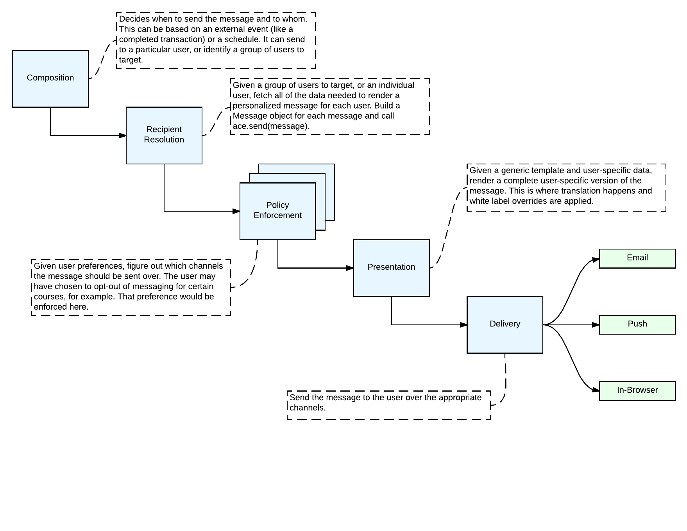

Design
======

Overview
--------

The **Automated Communications Engine (A.C.E.)** is a framework for automatically sending messages to users. It is
intended to support the identification of recipients and personalization of messages for each recipient.

The intent is for ACE to provide the application-specific logic that is easiest to manage in an environment that is
close to the source-of-truth data and outsource the generic functionality that is complex but not a core competency
of an education platform (like sending email). This line, of course, is a bit blurry, so we reserve the right in the
future to push more functionality into the third-party provider as our needs evolve. We may even choose to delegate
*all* of this functionality to a third-party at some point in the future.

Given the complexity of finding the right people to send the right message to with all of the needed personalization, we
try to handle that problem as closely to the source-of-truth as possible instead of trying to manage a complex
integration with a third-party system.

The following future requirements might encourage us to shift the line between custom and off-the-shelf in the future:

* Preference management across all channels
* Message analytics (open rates, click through rates etc)
* Frequency management and prioritization of messages across all channels and products
* Cost
* Personalized, intelligent timing of delivery (likely driven by a machine learning model)
* Digests and other summaries

Goals/Constraints
-----------------

ACE was designed with the following goals in mind:

1. Support edX base requirements (internationalization, accessibility, theming)
2. Allow future extension of adding new delivery mechanisms
3. Allow future extension of message delivery policy

The first goal we supported by choosing to use Django as the templating mechanism,
and by making ACE a library that could be used by many Django applications, rather
than a separate service that was called by many Django applications.

The second and third goal guided where we added extension points into the ACE
architecture.

Architecture
------------

A **RuntimeEnvironment** is a Django application that has included edx_ace as a djangoapp. ACE is running in the same
process as this application.

The **RuntimeEnvironment** provides:

* Translation files (\*.po)
* Settings - used to configure ACE
* Template resolution strategies
* Batching and resource management (queueing etc)

A :class:`~edx_ace.message.MessageType` represents a type of communication we might want to send to the learner. Our
various applications will want to define different :class:`MessageTypes <edx_ace.message.MessageType>`. Examples might
include ``RecurringReminder``, ``OrderConfirmation``, ``DeadlineReminder`` etc. It is user agnostic, however,
it can be used as a factory for :class:`~edx_ace.message.Message` objects by "personalizing" the generic message type
for a particular user.

A :class:`~edx_ace.channel.Channel` is a communication channel with the learner. Examples include Email, SMS, Push
Notifications, In-Browser Notifications etc.

An **Application** often wants to define several :class:`MessageTypes <edx_ace.message.MessageType>` and knows when to
send them to who. It is expected to be implemented as a djangoapp included in the same **RuntimeEnvironment** as ACE.

The **Application** is responsible for defining Django templates for each dynamic field required for each
:class:`~edx_ace.channel.Channel` for each :class:`~edx_ace.message.MessageType`. For an email, for example, this
includes the subject, from_name, body_html etc.

Django templates provide a lot of functionality we want out of the box, including:

* Interpolation of variables
* Control structures (conditionals, loops etc)
* Translations
* White label site-specific overrides
* Inheritance - this is very useful for emails since they often share a lot of HTML
* Static asset management - managing images and CDNs

The **Application** can define :class:`~edx_ace.message.MessageType` and use them to create
:class:`Messages <edx_ace.message.Message>`, or it can simply create the :class:`Messages <edx_ace.message.Message>`
directly.

A :class:`~edx_ace.recipient.Recipient` defines the contact information for the person who is intended to receive the
message. It must contain all of the needed information for each enabled :class:`~edx_ace.channel.Channel`. For example,
this might include the user's email address and/or notification key (for mobile push notifications).

The **Application** executes :meth:`ace.send(message) <edx_ace.ace.send>` for each message it wants to send. This
triggers the ACE message delivery pipeline.

It calls a series of registered :class:`~edx_ace.policy.Policy` objects in sequence to determine if the user should
actually receive the message and over which channels. This is where user preferences are enforced. These are
dynamically loaded using standard python plugin tools.

The **Presentation** tools render the message templates using the Django template engine.

Each :class:`~edx_ace.channel.Channel` has exactly one implementation that is called in sequence to transmit the
message to the user over the appropriate channel if and only if the policy has allowed communication over that channel.
An example is the :class:`edx_ace.channel.sailthru.SailthruEmailChannel`.

Decisions
---------
.. toctree::
    Braze Event Delivery <decisions/0001-braze-event-delivery>
